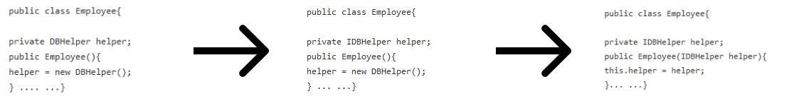

# SOLID Prensipleri

SOLID Prensiplerin temel amacı modüler bir yapı sağlayarak tekrar kullanılabilirliği, test edilebilirliği, bakımı ve genişletilmesini kolaylaştırmaktır. Yazılımı daha kolay gerçekleştirilebilir hale getirip, beklenmedik etkileri engellemeyi amaçlar.

---

### Single Responsibility

- Bir class veya  modül yalnızca bir işten sorumlu olmalıdır, aynı anda birbirinden farklı aktörler için hizmet vermemelidir. Aksi taktirde sorumluluklarından birinde yapacağımız bir değişiklik istenmeyen yerlerde hatalara sebep olabilir. Bir class veya modül için tanımlama yaparken tanım ne kadar uzuyorsa ve ne kadar çok "ve" kullanıyorsak, bu konseptten o kadar uzaklaşıyoruz demektir.
    

### Open-Closed

- Bir class için ana davranışı değiştirmeden, bu davranışının üzerine, izin verilen ölçüde, yeni eklemeler yapılabilir olması gerekir. Bu yaklaşım, class için önemli olan temel elemanları koruyarak, halihazırda bu classtan faydalanan birimlerde sorun oluşmasını engeller. Geliştirmelerde Single Responsibility ile ters düşmemek adına eklenen özelliklerin ana davranışa bağlı olmasına dikkat edilmelidir.
    
     

### Liskov Substitution

- Bir class üzerinden inheritance söz konusu olduğunda, üretilen child classların parent classın hizmetlerini yerine getirebilir olması beklenir. Child class istekler üzerine daha spesifik cevaplar verebilir olsa da verdiği cevaplar parent classın cevapları ile tutarlı olmalıdır.
 Burda child classlara esnek bir çalışma alanı bırakabilmek için parent classları olabildiğince abstract yapmak akılcı olacaktır.
    
    
    
### Interface Segregation
- Bir classtan beklenen aksiyonlar, o classın yapmakta yetersiz olduğu veya çalışma alanında olmayan aksiyonlar olmamalıdır, bu tanımlamalar gereksiz olup okunabilirlik açısından kötü bir etki yaratabilir. Bu kapsamda temelde aynı özelliklere sahip olsa da, farklı aksiyonlar gerçekleştirmek üzere geliştirilen classlar için, aksiyonlara yönelik interfaceler kullanılmalıdır.

 
### Dependency Inversion

- Bir class ile kullandığı araçlar arasında doğrudan değil de dolaylı bir ilişki olmalıdır. Bu ilişki interface aracılığıyla sağlanmalıdır. Bu sayede aracın nasıl çalıştığı class tarafından bilinmek zorunda değildir, aracın bağlantıyı sağlayan interface'in gerekliliklerini sağlaması yeterli olur. Bu durum classın bağımlılığını azaltmış olur ayrıca tekrar kullanılabilirlik de arttırılmış olur.
    
    

## SPRING ve SOLID Prensipleri

### Single Responsibility

- Spring Frameworkü ile SR arasındaki ilişkiyi basitçe Controller, Service ve Repository classları üzerinden anlatmaya çalışırsak;
    
    
    
  Bir para akışı modeli için, her düzeyde, gelir ve gider için gereken aksiyonları içeren classları oluşturmak, her classın bellirli ve alakalı use case kontrolleri yapmasını sağlar ve SR arttırır.

### Open-Closed

  - Aynı model üzerinden devam edilirse, Open-Closed ilkesi doğrultusunda en az değişiklik ile yeni özellik eklemeleri yapılabilmesi için ilk olarak, service ve controller arasındaki bağlantıyı azaltmak gereklidir. Bunu da araya bir başka interface katmanı ekleyerek yapabiliriz. Böylelikle service katmanını inject eden controller servicedeki değişikliklerden en az şekilde etkilenir.
      
    
      
    Bir adım daha gidip, yapıyı yeni özellik eklemelerine de uygun hale getirmek için, örnek olarak gelir gider hesplamaları gibi bir özellik eklemek için de aynı yapı kullanılır.
      
     

    Burda ServiceImpl classlarının hesaplama classlarına bağımlılığı en az seviyede tutulmuş olur ve daha sonradan gelecek başka türde hesaplamalar da bu CalculatorService arayüzü üzerinden gerçekleştirilebilir.

### Liskov Substitution

  - CashFlow projesi üzerinde geliştirme için devam edersek Liskov için yapabileceğimiz şey, service classlarını düzenlemek olacak. İlk olarak Controller classları için kullanılan serviceler ile hesaplama için kullanılan serviclerin ayrımını yapıyoruz ki hesaplama servisinin repository sınıfları ile olan gereksiz bağlantısı ortadan kalksın. Bunları kendi entityleri ile başka bir package içerisie taşıyoruz.
      
    
  
    Daha sonra Service türleri için de bir abstraction oluşturarak bağımlılığı daha da azaltıyoruz.
      
    
  
  Burdaki bir diğer önemli nokta da her iki service tipinin de Service parent classının gerekliliklerini yerine getirerek LS prensibine uyuyor olmasıdır.

### Interface Segregation

  - Ek olarak bir tane daha, gelir ve gider arasında dönüştürme yapan bir service yaratmak istediğimizde bunları tek bir service altında değil de, bir parentdan implement ederek oluşturduğumuzda, sınıfların ortak bir arayüzü implement edip gereksiz methodları override etmeye çalışmasını engellemiş oluruz.
      
  

### Dependency Inversion

  - Dependency Inversion Prensibi, High-Level elemanların, Low-Level elemanlara, abstraction ile bağlanması gerektiğini söyler.
  
    Önceki 4 prensip ile beraber yapı aşağıdaki gibi bir hal aldı ve Dependency Inversion sağlanmış oldu.
      
    

    Görüldüğü üzere farklı katmanlardaki elemanlar birbirlerine doğrudan değil, Dependency Inversion doğrultusunda arayüzler aracılığıyla soyutlanarak bağlanmış durumdadır.

## Dependency Inversion, Dependency Injection ve Inversion of Control

  - Dependency Inversion farklı seviyelerdeki modül veya sınıfların arasındaki iletişimin arayüzler aracılığıyla sağlanarak bağımlılığı azaltır ancak yine de instance tanımlamaları hala tanımlanan sınıf tarafından yapıldığı için bağımlılık tam manasıyla sağlanmış değildir.
    Bunu aşmak için Dependency Injection kullanılır. Dependency Injection, Inversion of Control prensibini implement eden bir design patern’dır. Bağımlılıklar class’a dışarıdan “enjekte” edilir.
      
    
